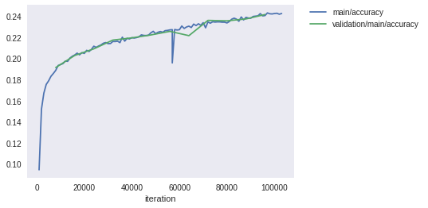
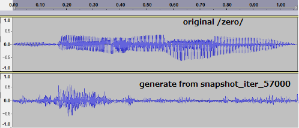

# WaveNet

## Abstract  

This is a clone of [Chainer-Examples-WaveNet](https://github.com/chainer/chainer/tree/master/examples/wavenet) and an experiment on Google Colaboratory.  

[github repository](https://github.com/shun60s/chainer-examples-wavenet-clone)  
  
## Details of Operation  

Please see the document "Synthesize_Human_Speech_with_WaveNet" in the docs folder. That's a softcopy of web of chainer-colab-notebook, wavenet in the reference.  

## Experiment on Google Colaboratory  

Chainer-colab-notebook, Synthesize Human Speech with WaveNet, using CSTR VCTK Corpus.  
Following is Loss and Accuray vs iteration, around 11 hours computation, 7 epochs.  

  
  

Accuracy is still too low (loss is still high), if without conditioning, waveform generation will fail.  

## Samples  

In the samples folder, there are original and generated wav files, and model file (a snapshot).
Suffix of snapshot_iter shows iteration number.
Original wav are some wav of Pannous, english digits. (Please see reference link.)  
When you generate using this model file,
You should specify --n_loop 2 as generate.py arrangement, due to Chainer-colab-notebook wavenet n_loop is 2.  

  

At this iteration, generated waveform is still dirty than original human speech waveform.  

  

Athough generated waveform from iteration only 8000, it can hear some reverberation of utterance /nine/(=digit 9).  
It's may conditoning trick !?  

## Reference  

- [chainer-colab-notebook, Synthesize Human Speech with WaveNet](https://chainer-colab-notebook.readthedocs.io/ja/latest/notebook/official_example/wavenet.html)
- [chainer-examples-wavnet](https://github.com/chainer/chainer/tree/master/examples/wavenet)
- [CSTR VCTK Corpus](http://homepages.inf.ed.ac.uk/jyamagis/page3/page58/page58.html)
- [wav of Pannous, Description](https://github.com/AKBoles/Deep-Learning-Speech-Recognition/blob/master/Pannous-Walkthrough.md)

## License  

Regarding to Chainer, please see the LICENSE-chainer.txt in the docs folder.  
  
  

